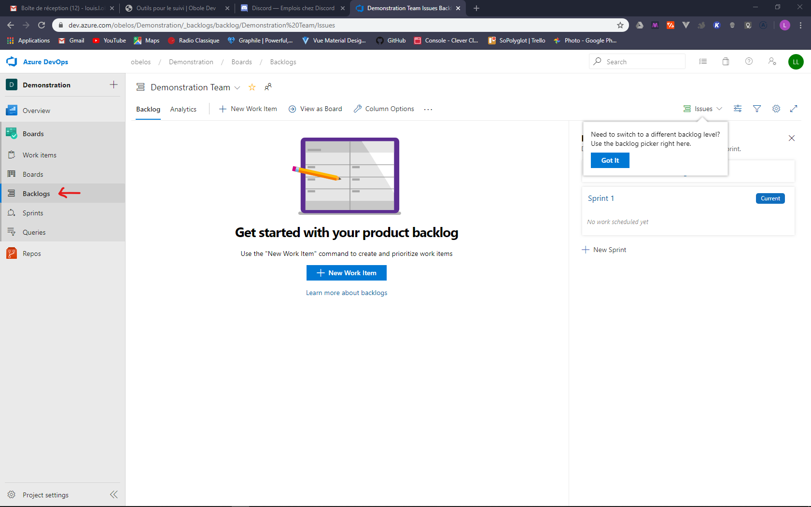

# Gérer son backlog

La gestion du backlog est la tâche la plus lourde du *product owner*. Pour faciliter cette tâches des outils et des principes rigides sont mis en place pour ce concentrer sur l'essentiel: couvrir les fonctionnalités nécessaires et les faire passer à l'équipe de développement sans laisser de portes ouvertes à l'interprétation.

Le projet est géré depuis **Azure DevOps**. Un exemple est donné [ici](https://dev.azure.com/obelos/Demonstration)

## Le *backlog*
### C'est quoi le *backlog* ?
Le backlog, c'est l'ensemble des demandes du *product owner*. Il est composé d'***Epics*** - les grandes fonctionnalité du projet, eux-même découpés en ***user stories*** (ou *issues*) qui présentent des cas d'utilisation concrets. Nos attentes concernant le contenu des *epics* et de *user stories* est décrit en détails plus bas sur cette page.
### Pour y accéder
La gestion du backlog se fait dans **Azure Boards**. Rendez-vous sur l'espace du projet (nous vous enverrons un lien) et via le menu de gauche: boards ➡️ backlog

## les *Epics*
### C'est quoi un *epic*
Un *epic* décrit une fonctionnalité du projet. L'ensemble des *epics* doit donner une bonne compréhension du projet, et les epics à traiter doivent être définis au début du projet. Les *epics* on pour objectif de classer les *user stories* (voir ensuite) et de donner une vue d'ensemble du projet dès le début. Il ne s'agit pas de rentrer dans le détail des fonctionnalités. Les epics ne doivent pas radicalement changer durant le projet, et pas sans consultation des participant au projet. 

Nous vous demandons de bien vouloir adopter le formalisme suivant pour la définition des epics.
titre|description|exigences
---|---|---
un titre court ciblant clairement une fonctionnalité|un texte explicant la fonctionnalité espérée dans les grandes lignes, en bon français, sur lequel vous pouvez rajouter tout élément que vous jugerez pertinant pour nous aider à cerner le besoin|une serie de bullet points definissant les cas traités par cette fonctionnalité à un niveau plus fin

### Pour en créer un
Depuis le backlog, passez en mode "*epics*"

Créez un nouvel *epic*:

L'*epic* va apparaître dans la liste en dessous. En cliquant dessus depuis la liste, vous pourrez le modifier et le compléter comme dans l'exemple suivant:

Les seuls champs à modifier de la carte *epic* sont le titre et la description.

## Les *User stories*
### C'est quoi une *user story* ?
Les *user stories* se réferrent à un *epic* et décrivent en détail les cas d'utilisation correspondant à la fonctionnalité décrite dans l'*epic*. Avant d'écrire les *user stories*, nous définissons des *rôles* (à ne pas confondre avec les rôles des participants au projet), qui auront des permissions différentes sur le site ou l'application développée. Le plus souvent il n'y a que trois rôles: **anonyme** pour un visiteur non connecté, **utilisateur** pour un visiteur connecté et **administrateur**. Selon les projets, il y aura plus ou moins de rôles différents.

Les *user stories* correspondent à un souhait précis d'un visiteur ayant un rôle donné, et sont exprimées dans le formalisme suivant: 

> En tant que `<role>`, je souhaite `<un souhait unique>`

L'équipe de développement va traiter les *user stories* une à une, en traduisant les attentes "métier" en termes techniques. Pour s'assurer d'avoir bien rempli les attentes du *product owner*, les *user stories* doivent aussi comporter des critères d'acceptation, dans la forme suivante:
> Lorsque je `<action unique>`, alors `<conséquences de l'action>`
### Pour en créer une